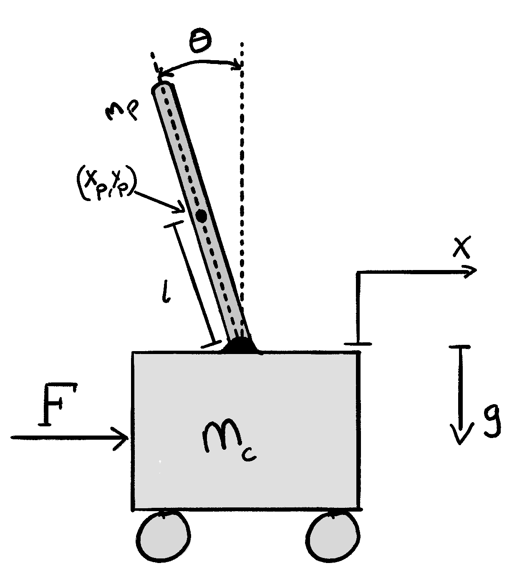
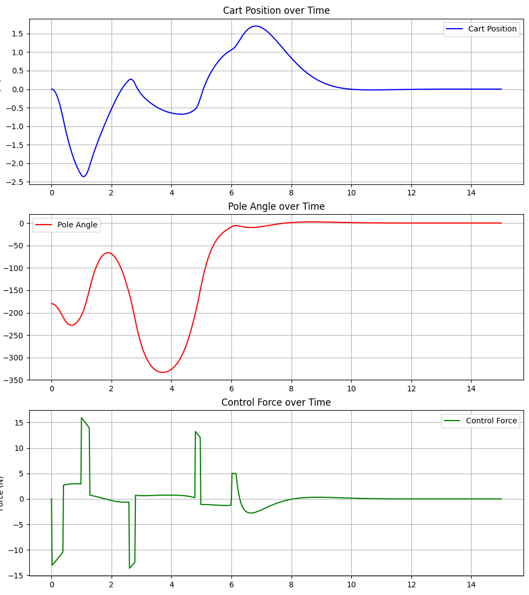
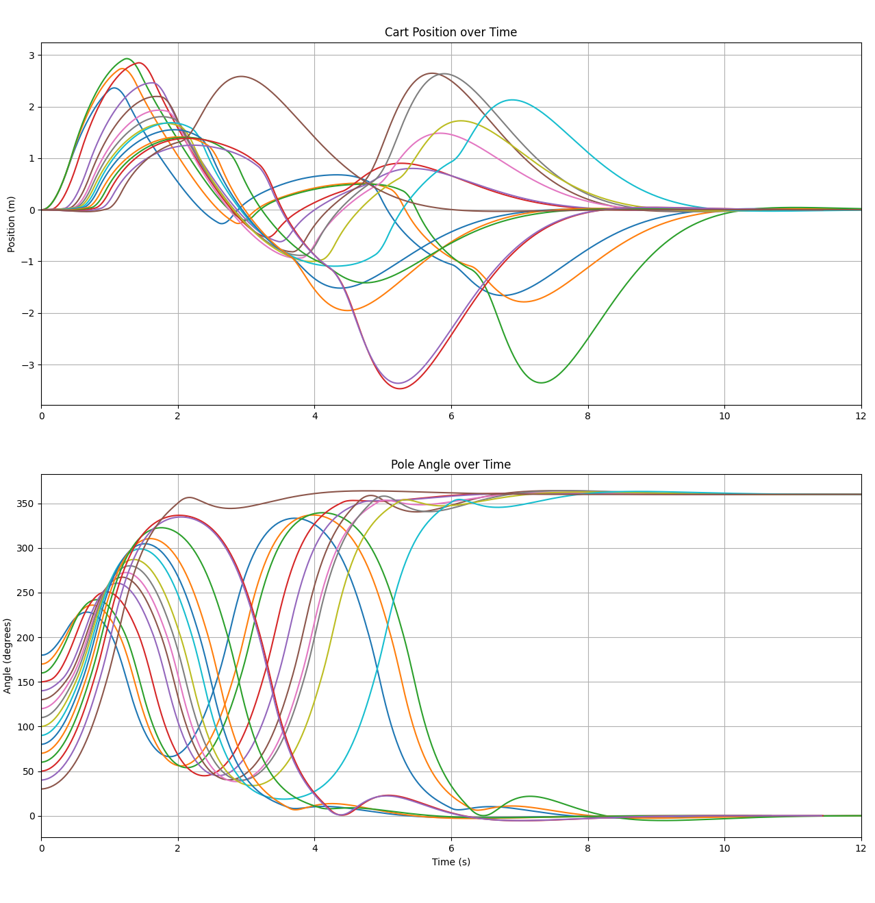
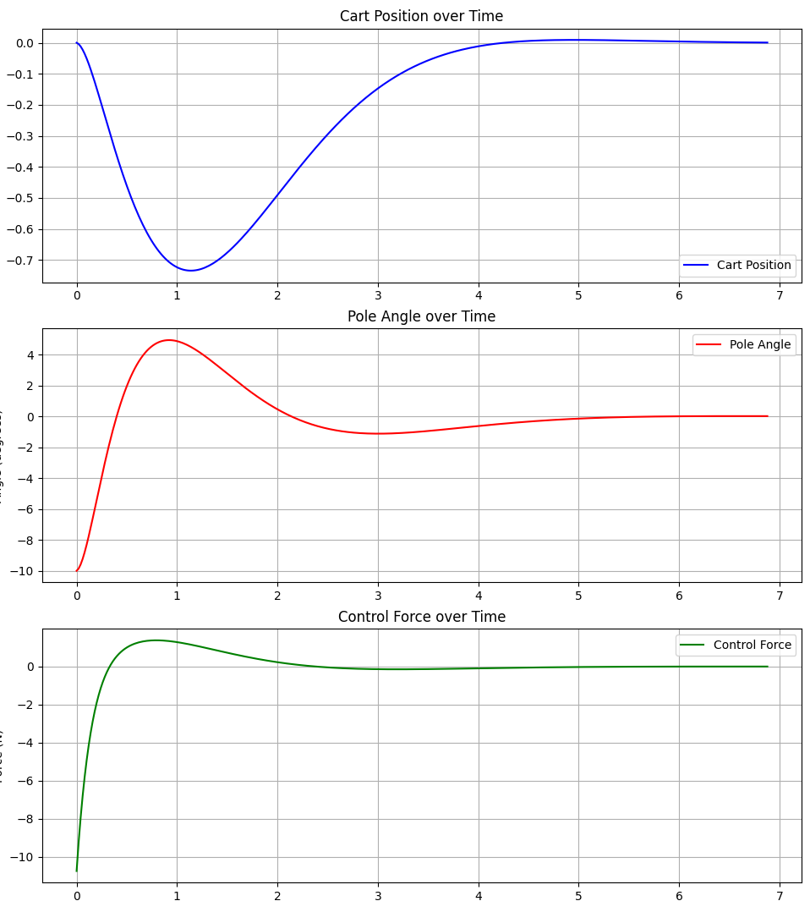
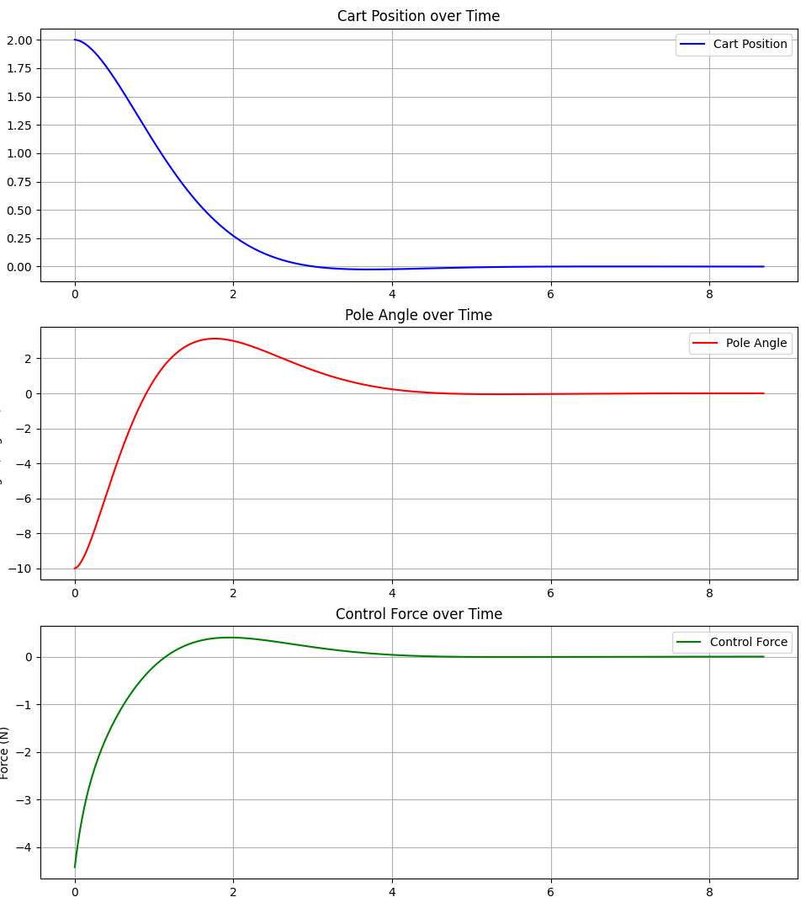

# Cart-Pole Control: LQR Stabilization with Energy-Based Swing-Up

A Python implementation of a hybrid control system for the inverted pendulum on a cart problem. This project combines energy-based control for swing-up maneuvers with Linear Quadratic Regulator (LQR) control for stabilization at the upright position.


## Overview

The cart-pole system is a classic problem in control theory where an inverted pendulum is mounted on a cart that can move horizontally. The challenge is to balance the pendulum in the upright position while controlling the cart's position. This implementation uses two complementary control strategies:

- **Energy-Based Swing-Up Controller**: Pumps energy into the system to swing the pendulum from its hanging position toward the upright position
- **LQR Controller**: Takes over when the pendulum enters the region near vertical, providing optimal stabilization

The controllers automatically switch based on the pendulum's angle, creating a robust hybrid system capable of stabilizing the pendulum from a wide range of initial conditions.

## How It Works

### The Problem

The inverted pendulum on a cart is an inherently unstable system. When upright, any small disturbance will cause it to fall unless active control is applied. The system has four state variables:
- Cart position (x)
- Cart velocity (ẋ)
- Pole angle (θ, measured from vertical)
- Pole angular velocity (θ̇)



### Control Strategy

**Energy-Based Swing-Up**  
When the pendulum is hanging down or away from vertical, the energy controller calculates the difference between the current system energy and the desired energy at the upright position. It then applies forces to pump energy into the system, swinging the pendulum higher with each oscillation until it approaches the upright position.

**LQR Stabilization**  
Once the pendulum enters a region near vertical (where the system can be linearized), the LQR controller activates. The LQR controller is designed by solving the Riccati equation to find optimal state feedback gains that minimize a cost function balancing control effort and state error. This provides smooth, efficient stabilization around the equilibrium point.

The system linearization around θ = 0 and the LQR gain calculation are implemented in [`src/CartPole_Simulation.py`](src/CartPole_Simulation.py) (see `LQRController` class).

### Results

The system successfully stabilizes the pendulum from various initial conditions:

**Single trajectory with swing-up and stabilization:**


**Multiple initial starting angles converging to equilibrium:**


**Different starting positions using only LQR controller:**
<table>
<tr>
<td></td>
<td></td>
</tr>
</table>

## Installation

### Requirements
- Python 3.7+
- Required packages:
  ```bash
  pip install pygame matplotlib numpy scipy control
  ```

### Setup
Clone the repository:
```bash
git clone https://github.com/Podolskigutten/Inverted_Pendulum.git
cd Inverted_Pendulum
```

## Usage

Run the simulation:
```bash
python src/CartPole_Simulation.py
```

The simulation will:
1. Start with the pendulum in a hanging position
2. Apply the energy-based swing-up controller
3. Automatically switch to LQR control near the upright position
4. Display real-time visualization using Pygame
5. Generate plots of cart position, pole angle, and control force after simulation ends

### Customization

You can modify the physics parameters and control gains in the code:

**Physics parameters** (in `PhysicsParams` class):
- Cart mass, pole mass, pole length
- Friction coefficients
- Force limits

**LQR tuning** (in `LQRController` class):
- Q matrix: state cost weights [x, ẋ, θ, θ̇]
- R scalar: control effort cost

**Initial conditions** (in `CartPoleEnv.reset()` method):
- Starting angle, position, and velocities

## Technical Details

For a detailed analysis of the system dynamics, controller design, and robustness evaluation, see the full scientific paper: [Evaluating the Robustness.pdf](Evaluating%20the%20Robustness.pdf)

The paper includes:
- Complete mathematical derivation of system dynamics
- LQR controller synthesis methodology
- Stability analysis and performance metrics
- Robustness evaluation under parameter uncertainties

## Project Structure

```
Inverted_Pendulum/
├── src/
│   ├── CartPole_Simulation.py    # Main simulation and control implementation
│   └── lqr_cartpole.mlx           # MATLAB analysis (reference)
├── imgs/                          # Result plots and diagrams
├── Evaluating the Robustness.pdf  # Scientific paper
└── README.md
```

## References

- [Modern Control Engineering by Ogata](https://www.pearson.com/en-us/subject-catalog/p/modern-control-engineering/P200000003484)
- [Underactuated Robotics by Tedrake](http://underactuated.mit.edu/)
- [Python Control Systems Library Documentation](https://python-control.readthedocs.io/)

## License

This project is open source and available under the MIT License.